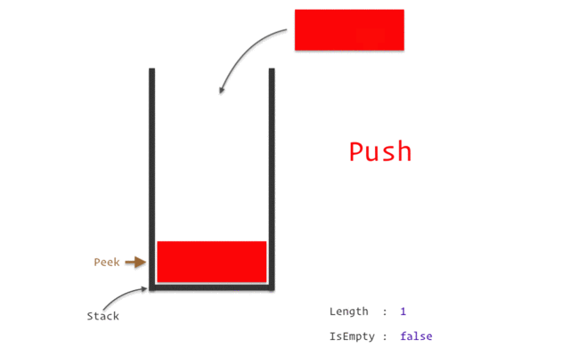

# Introduction

Binary Exploitation especially in CTFs is a niche topic that most people avoid but it can be quite interesting (from my POV). Binary Exploitation or PWN are a type of challenge that requires you to exploit vulnerabilities from programs from a remote server either by gaining Remote Code Execution (RCE) or modifying certain functions

One of the most simplest forms of binary exploitation occur on the **stack**, a region of memory that stores temporary variables created by functions in code.

<figure><figcaption>
Visualization of the stack
</figcaption></figure>

Now I am not a fan of learning by reading theory but instead love to get technical hands-on, this also applies to other categories. You need to do it to get the feel yourself until it becomes second nature.
