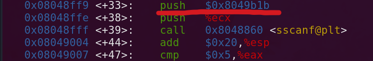

# Phase 2

Set the breakpoint to the current phase

<figure><figcaption></figcaption></figure>

Run the program with the previous phases' answer

<figure><figcaption></figcaption></figure>

Input any answer. We will not blowup because of the breakpoint has been set

<figure><figcaption></figcaption></figure>

disassemble the program to see the assembly in action using `disass`

<figure><figcaption></figcaption></figure>

Yes. Everything looks overwhelming. First, things first look at the functions. We can see two functions that are quite literally in english, `read_six_numbers` and `explode_bomb`. Let's take a peek inside the function

Now see this arrow at the left side? Its showing where the current instruction is

<figure><figcaption></figcaption></figure>

Now, we use `until*<address>` to skip a few instructions straight to the `read_six_numbers` instruction which is `0x08048b5b`

<figure><figcaption></figcaption></figure>

use the `si` command to 'step into' the function and then use `disass` to dissasemble it. You should be in the function now.

<figure><figcaption></figcaption></figure>

There are 2 things we should notice here,

1. 6 values are being loaded into addresses (lea) and pushed to the stack. These are storage locations for user input

```wasm
0x08048fe4 <+12>: lea    0x14(%edx),%eax  ; edx + 0x14
0x08048fe7 <+15>: push   %eax             ; push edx+0x14 (for 6th number)

0x08048fe8 <+16>: lea    0x10(%edx),%eax  ; edx + 0x10
0x08048feb <+19>: push   %eax             ; push edx+0x10 (for 5th number)

0x08048fec <+20>: lea    0xc(%edx),%eax   ; edx + 0xc
0x08048fef <+23>: push   %eax             ; push edx+0xc (for 4th number)

0x08048ff0 <+24>: lea    0x8(%edx),%eax   ; edx + 0x8
0x08048ff3 <+27>: push   %eax             ; push edx+0x8 (for 3rd number)

0x08048ff4 <+28>: lea    0x4(%edx),%eax   ; edx + 0x4
0x08048ff7 <+31>: push   %eax             ; push edx+0x4 (for 2nd number)

0x08048ff8 <+32>: push   %edx             ; push edx (for 1st number)
```

2. Right before the function `sscanf` is called, there is an immediate value being pushed which can be deducted that it is pointing to a string (format string).&#x20;

<figure><figcaption></figcaption></figure>

We can examine the value of the string using x /s&#x20;

```wasm
(gdb) x /s 0x8049b1b 
0x8049b1b:      "%d %d %d %d %d %d"
```

Now that we know the format of the input, let's restart the program, set a breakpoint like earlier and try to input `1 2 3 4 5 6`

<figure><figcaption></figcaption></figure>

Next, try to notice the lines in the red box.&#x20;

<figure><figcaption></figcaption></figure>

* `cmpl $0x1, -0x18(%ebp)`&#x20;

is checking the first number that was read and stored by `sscanf` function and comparing it to 1

* `je 0x8048b6e <phase_2+38>`&#x20;

is a condition checking where the instruction will jump to `<+38>` if equal

* `call 0x80494fc <explode_bomb>`&#x20;

is a function call that will trigger the bomb to go off if the condition is not satisfied

* `mov $0x1, %ebx`&#x20;

&#x20;Initializes `%ebx` register with the value 1 (loop counter)&#x20;


Now we know that it is a loop, I will try to structure it&#x20;

<figure><figcaption></figcaption></figure>

Based, on `<+27>` , we know, that the first number is 1. The next thing we should do is use `until` to jump the instructions until `<+54>` , that way we can print value of `%eax` at the point of comparison.

<figure><figcaption></figcaption></figure>

Now we use `print $eax`

```wasm
(gdb) print $eax
$1 = 2
```

Now we have the second number which is 2, just go down the rest of the instructions using `until` or `ni`, follow the loop and see what `%eax` is equal to. If your initial input was like mine:

1,2,3,4,5,6

You need to restart the program with the new inputs everytime you get the correct number or the bomb will go off.

This is the third number after the 1st loop:

```wasm
(gdb) print $eax
$2 = 6
```

Eventually, you will find that the 6 correct numbers were:

`1 2 6 24 120 720`

<figure><figcaption></figcaption></figure>


