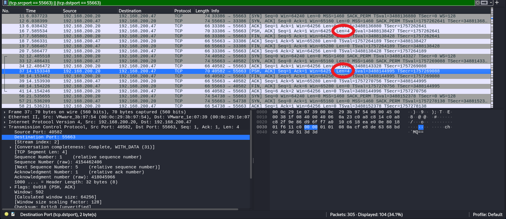
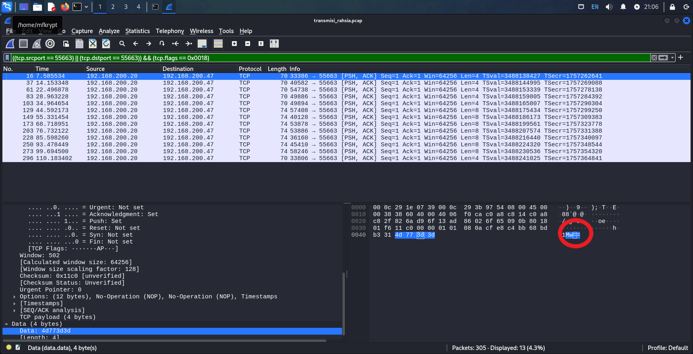

# Pangkalan

We are given a pcap file "transmisi\_rahsia.pcap"

The challenge description hints about port 55663. So lets filter it accordingly for source OR destination.

<figure><figcaption></figcaption></figure>

Now, if you look closely at the packets that contain \[PSH,ACK] flags, there are some lengths of data present

<figure><figcaption></figcaption></figure>

So let's add another filter, that only leaves us with the packets that contain \[PSH,ACK] flags

<figure><figcaption></figcaption></figure>

Another thing to notice is the data being transmitted is some characters with base64 padding

<figure><figcaption></figcaption></figure>

Just copy them at every packet and throw it into a decoder and we got a transmission

<figure><figcaption></figcaption></figure>

The initials of the transmission is the flag

Flag: <mark style="color:red;">`3108{malbatt}`</mark>
