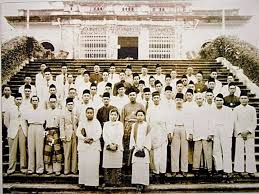

# Malayan Union

Selepas memuat turun pautan yang diberikan. Sekeping gambar akan dipaparkan.

<figure><figcaption></figcaption></figure>

Soalannya memberikan petunjuk bahawa kita harus input jawapannya sebagai nama sebuah tempat. Namun, saya telah mencuba pelbagai jawapan seperti Tapah, Perak tetapi masih salah. Kemudian, rakan sekelas _History Buff_ saya, @[NightOwl](https://naufaljaffri.notion.site/Blog-5a52fe853ac44c1ca70235bb9257f94e) yang **tidak dapat menyertai** acara 3108 CTF memberi syarahan sejarah tentang asal usul UMNO.&#x20;

Selepas itu, saya cuba-cuba untuk mengekstrak fail gambar tersebut, mana tau ada sesuatu hahah.

<figure><figcaption></figcaption></figure>

Ternyata, memang ada fail .txt, dan nampaknya ia adalah pautan ke sebuah video youtube

<figure><figcaption></figcaption></figure>

&#x20;Video tersebut hanya menceritakan tentang sejarah kesultanan Johor. Tetapi, apabila kita pergi ke bahagian komen. Terdapat satu komen yang menarik

<figure><figcaption></figcaption></figure>

ia adalah teks yang dikod dalam base64

<figure><figcaption></figcaption></figure>

Link tersebut membawa kita ke sebuah laman web yang membolehkan kita untuk memuat turun sebuah file yang bernama "umno-3108.jpg"

<figure><figcaption></figcaption></figure>

Selepeas dimuat turun fail gambar tidak boleh dibuka

<figure><figcaption></figcaption></figure>

Periksa Hex fail gambar tersebut dan bandingkan dengan ciri-ciri file (_File signatures_)

<figure><figcaption></figcaption></figure>

<figure><figcaption></figcaption></figure>

Kalau periksa dengan teliti, **tiga byte** pertama fail umno tidak sama. Ini boleh menyebabkan fail menjadi rosak.&#x20;

Boleh baiki fail tersebut dengan menukar bytes seperti dalam format yang betul.

<figure><figcaption></figcaption></figure>

Dan fail tersebut dapat dibuka.

Gambar tersebut menunjukkan para pembesar, pegawai, dan rakyat Johor bersama-sama menzahirkan rasa tidak puas hati mereka melalui pelbagai cara, termasuk menghantar petisyen, mengadakan perhimpunan, dan mengadakan bantahan di Istana Besar Johor.

Flag: <mark style="color:red;">`3108{istana_besar}`</mark>
