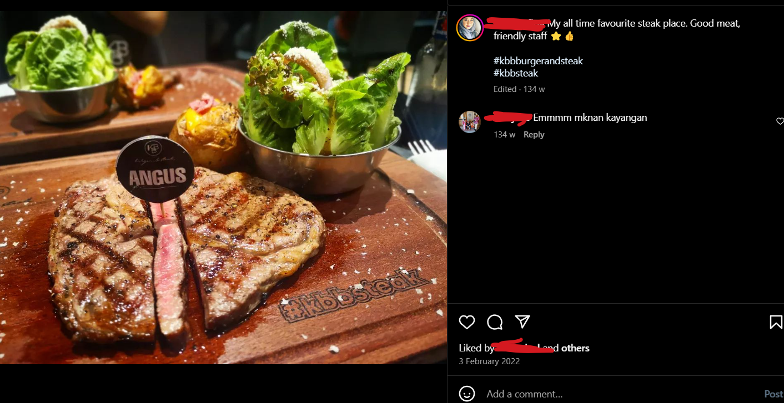

# Privacy Matters

Checked out the account on my tablet and had a look at his followings, forgive the blurriness

<figure><figcaption></figcaption></figure>

<figure><figcaption></figcaption></figure>

<figure><figcaption></figcaption></figure>

Checkec out his Instagram, and found a cropped flag

<figure><figcaption></figcaption></figure>

The clue was the covered up name of the place he was having steak and his instagram story before which showed that he was at KTCC Mall. Did a google search of "KTCC mall steakhouse" and found out a similar pattern of the platter hashtag which was **kbbsteak**

<figure><figcaption></figcaption></figure>

Checked the reviews

<figure><figcaption></figcaption></figure>

<figure><figcaption></figcaption></figure>

Flag: <mark style="color:red;">`3108{J4g4_pr1v4cy_4nd4!}`</mark>
