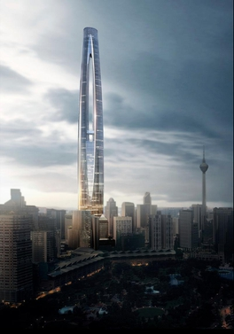

# Tinggi Lagii

Given is an image file

<figure><figcaption></figcaption></figure>

The building is called '**Tradewinds Square Tower'**

Google time

<figure><figcaption></figcaption></figure>

Flag: <mark style="color:red;">`3108{3.15, 101.71}`</mark>
