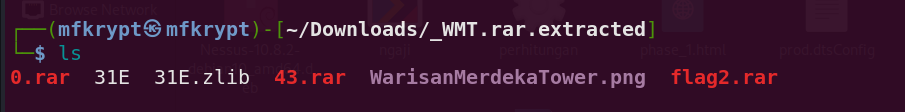
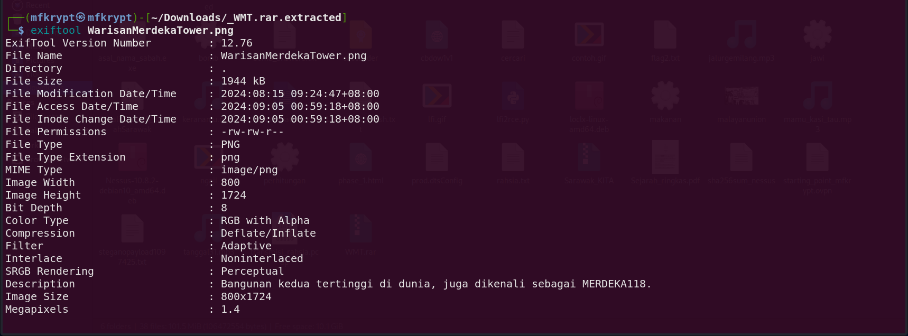

# Tinggi Mat

We are given a .rar file. Unzip it using binwalk to see the contents

<figure><figcaption></figcaption></figure>

The flag2.rar seems to be locked with a password. Let's inspect the metadata image file first

<figure><figcaption></figcaption></figure>

The "MERDEKA118" looks odd for being all-caps. Try inputting it as password for the locked .rar file

We are able to unlock the file. Now we receive a txt file which looks normal and it took me a while to figure it out that it had something to do with **Unicode Steganography with Zero-Width Characters.**

<figure><figcaption></figcaption></figure>

<figure><figcaption></figcaption></figure>

We have the 2nd part of the flag. To find the 1st part is actually to use **zsteg** on the image file. I had to refer to other people writeup for this bruh...

<figure><figcaption></figcaption></figure>

Flag: <mark style="color:red;">`3108{th3_t4ll3st_0n3_1n_M4l4ys14!}`</mark>

