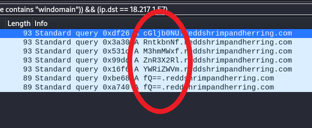

# Wireshark-two-two

Here is the challenge

<figure><figcaption><p>Figure 1</p></figcaption></figure>

Download the file and check the Protocol Hierarchy like usual

From the bottom let's check the text data

<figure><figcaption><p>Figure 2</p></figcaption></figure>

Follow the TCP stream

<figure><figcaption><p>Figure 3</p></figcaption></figure>

Try inspecting the packets individually

<figure><figcaption><p>Figure 4</p></figcaption></figure>

And we found the flag…or did we? I was skeptical at first so I tried submitting the answer and it was wrong(lol) After that, I checked the other streams and it came with a lot of different fake flags

<figure><figcaption><p>Figure 5</p></figcaption></figure>

After checking the different streams, I came across this under TCP stream.

<figure><figcaption><p>Figure 6</p></figcaption></figure>

Did a quick google search of red shrimp and herring and found nothing but I did find this…then it made sense with all the fake flags

<figure><figcaption><p>Figure 7</p></figcaption></figure>

I continued to scroll down the TCP stream but nothing was useful so I checked other protocols and came across this at DNS

<figure><figcaption><p>Figure 8</p></figcaption></figure>

Looks like a bunch of gibberish queries made to google. Much of the responses are “no such name”. First, lets filter out the responses and leave out the queries only since the responses are useless anyway

Go to the “Domain Name System (query)” option and click the “Flags” drop down. Then, right click the “Message is a query”. We choose “and selected” to stack the filters on top of “dns” filter.

<figure><figcaption><p>Figure 9</p></figcaption></figure>

<figure><figcaption><p>Figure 10</p></figcaption></figure>

And we are left only with queries that are made to Google. Next, lets filter out the “amazon” keyword because if you look closely the query names are repeating itself

<figure><figcaption><p>Figure 11</p></figcaption></figure>

Go to the “Queries” drop down and click the other drop down again and you will see the name and apply the filter

<figure><figcaption><p>Figure 12</p></figcaption></figure>

The current filter would look like this:

`((dns) && (dns.flags.response == 0)) && (dns.qry.name == "IDqoR16q.reddshrimpandherring.com.us-west-1.ec2-utilities.amazonaws.com")`

But we don’t want to filter the query name. So lets just filter the queries that contains “amazon”. Btw we also need to put “!” in front so we invert the filter (means remove anything that contains “amazon”)

`((dns) && (dns.flags.response == 0)) && !(dns.qry.name contains "amazon")`

<figure><figcaption><p>Figure 13</p></figcaption></figure>

Let’s filter out “windomain” as well

<figure><figcaption><p>Figure 14</p></figcaption></figure>

That looks much better. Now, if we scroll down a bit we can see some of the destinations are 18.217.1.57. Remember when we were encountering the fake flags?

<figure><figcaption><p>Figure 15</p></figcaption></figure>

Seems like this is the real destination instead of the google ip address. Let’s filter the ip address destination to only 18.217.1.57

<figure><figcaption><p>Figure 16</p></figcaption></figure>

And that looks like our flag encoded in base64. At this point, we could just throw it into cyberchef and be done with it but yeah...Let’s open tshark, which is the terminal version of wireshark.

```sh
$ tshark -nr shark2.pcapng

#‘-n’ option would tell tshark to use the numeric format for IP addresses and port number

#'-r’ option reads packets from specified pcap file instead of capturing live traffic
```

In this case we are going to use all the filters we applied earlier in the tshark syntax by adding “-Y” in front and enclosing the filters with quotes.

```sh
$ tshark -nr shark2.pcapng -Y "(((dns) && (dns.flags.response == 0)) && !(dns.qry.name contains "amazonaws") &5 !(dns.qry.name contains "windomain")) && (ip.dst == 18.217.1.57)*
```

```sh
#Output

1633      9.334169 192.168.38.104 - 18.217.1.57 DNS 93 Standard query 0xdf26 A cGljbONU.reddshrimpandherring.com
2042      11.870534 192.168.38.104 - 18.217.1.57 DNS 93 Standard query 0x3a38 A RntkbnNf.reddshrimpandherring.com
2444      14.503146 192.168.38.104 - 18.217.1.57 DNS 93 Standard query 0x531d A M3hmMWxf.reddshrimpandherring.com
3140      16.404809 192.168.38.104 - 18.217.1.57 DNS 93 Standard query 0x99dd A ZnR3X2Rl.reddshrimpandherring.com
3429      18.239530 192.168.38.104 - 18.217.1.57 DNS 93 Standard query 0x16f6 A YWRiZWm.reddshrimpandherring.com
2969      20.266171 192.168.38.104 - 18.217.1.57 DNS 89 Standard query 0xbe68 A fQ==.reddshrimpandherring.com
4361      22.481648 192.168.38.104 - 18.217.1.57 DNS 89 Standard query 0xa748 A fQ==.reddshrimpandherring.com
```

Let’s get rid of the rest of the columns by using “awk”. We leave the options default for awk because it recognises the columns by spaces/whitespace

```sh
$ tshark -nr shark2.pcapng -Y "(((dns) && (dns.flags.response == 0)) && !(dns.qry.name contains "amazonaws") && !(dns.qry.name contains "windomain")) && (ip.dst == 18.217.1.57)" | awk "{ print $12 }'
```

Note: $12 (12 is the n'th column)

```sh
#Output

cGljbONU.reddshrimpandherring.com
RntkbnNf.reddshrimpandherring.com
M3hmMWxf.reddshrimpandherring.com
ZnR3X2Rl.reddshrimpandherring.com
YWRiZWVm.reddshrimpandherring.com
fQ==.reddshrimpandherring.com
fQ==.reddshrimpandherring.com
```

Now let’s get rid of the other columns by specifying the “.” Using “-F” option

```sh
$ tshark -nr shark2.pcapng -Y "(((dns) && (dns.flags.response == 0)) && !(dns.qry.name contains "amazonaws") && !(dns.qry.name contains "windomain")) 66 (ip.dst == 18.217.1.57)" | awk "{ print $12 }' | awk -F "." '{ print $1 }'
```

```sh
#Output

cGljbONU
RntkbnNf
M3hmMwxf
ZnR3X2RL
YWRLZWVm
fQ==
fQ==
```

After that, we delete the newline by using translate or “tr"

```sh
$ tshark -nr shark2.pcapng -Y "(((dns) && (dns.flags.response == 0)) && !(dns.qry.name contains "amazonaws") 6& !(dns.qry.name contains "windomain")) 65 (ip.dst == 18.217.1.57)" | awk '{ print $12 }' | awk -F "." '{ print $1 }' | uniq | tr -d '\n' 
```

Note: uniq is used to remove duplicate outputs (eg: fQ==)

And we got the flag in base64. Just head to a online decoder and submit :)

```sh
cGljb0NURntkbnNfM3hmMWxfZnR3X2RlYWRiZWVmfQ==
```

<figure><figcaption><p>Figure 17</p></figcaption></figure>

The flag is: `picoCTF{dns_3xf1l_ftw_deadbeef}`
