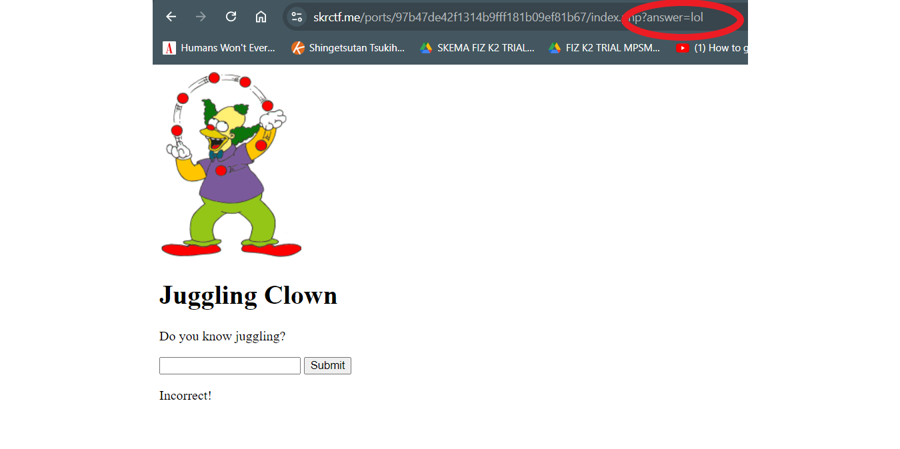

# Juggling Clown

<figure><figcaption></figcaption></figure>

When redirected to the page, we are met with with this

<figure><figcaption></figcaption></figure>

As the name of the challenge implies, this must be regarding Type Juggling vulnerability in PHP, where strings that don't look like numbers become '0' when PHP tries to convert them to a number. For example,

1. <mark style="color:red;">**Numeric Strings**</mark>: If a string contains only numbers (like `"123"`), PHP converts it to the corresponding integer (`123`).

```php
$a = "123";  // String
$b = $a + 0; // PHP converts "123" to 123 (integer), so $b is 123
```

2. <mark style="color:red;">**Non-Numeric Strings**</mark>: If a string starts with something that PHP can’t interpret as a number, like letters or special characters, PHP converts it to `0`.

```php
$a = "abc";  // String
$b = $a + 0; // PHP converts "abc" to 0 (integer), so $b is 0
```

Anyways, that's enough of that, let's get into the challenge

Let's try checking the source

<figure><figcaption></figcaption></figure>

The `?source` link leads us to the PHP logic behind it&#x20;

```php
<?php  
    include ('secret.php');
    if(isset($_GET["source"])){
        highlight_file(__file__);
        die;
    }
?>

<!DOCTYPE html>
<html>
<head>
    <title>Juggling Clown</title>
</head>
<body>
    
    <h1>Juggling Clown</h1>
    <p>Do you know juggling?</p>
    <form action="index.php">
        <input type="text" name="answer">
        <input type="submit">
    </form>
    <?php  
        if(isset($_GET["answer"])){
            if(strcmp($answer , $_GET["answer"]) == 0){
                echo "<p>Correct! Here's your flag: {$flag}</p>";
            }else{
                echo "<p>Incorrect!</p>";
            }
        }
    ?>
    <p></p>
    <a style="color: white" href="?source">View Sauce</a>
</body>
</html>
```

At the top of it, we can see there is an endpoint called `secret.php` let's try it.

<figure><figcaption></figcaption></figure>

Welp, that was expected. Moving on, by reading the code there are some lines that stand out

```php
if(strcmp($answer , $_GET["answer"]) == 0){
                echo "<p>Correct! Here's your flag: {$flag}</p>";
            }else{
                echo "<p>Incorrect!</p>";
            }
```

The usual cases for Type Juggling vulnerabilities will have either:

1. <mark style="color:green;">**Loose Comparison**</mark>: using `== or !=` : both variables have "the same value".
2. <mark style="color:green;">**Strict Comparison**</mark>: using `=== or !==` : both variables have "the same type and the same value".

The code of block uses a `strcmp()` function comparing two string parameters where if they are equal, the function will return 0 and resulting the flag being printed.

I did a bit of reserach into the function and it seems there is an exploit which you can input an empty array into the parameter

<figure><figcaption></figcaption></figure>

This happens because `strcmp()` compares two strings. If you input an integer, It will just convert it to a string and the `if` condition will result in false.&#x20;

But what if you input an array? PHP will produce a warning and return `null` due to type mismatch

`null` **is treated as `0` when comparing with `==`**. So, when `strcmp()` returns `null`, the comparison `null == 0` is `true` in PHP.

Let's try it out and get the parameter in the URL by submitting a random value

<figure><figcaption></figcaption></figure>

<figure><figcaption></figcaption></figure>

Now we enter the empty array within the parameter, the value can be anything

<figure><figcaption></figcaption></figure>

Looks like we got em. Great challenge for beginners like myself

Flag: `SKR{D0n't_U5e_L00s3_C0mp4ris1On_ebc0ce`
