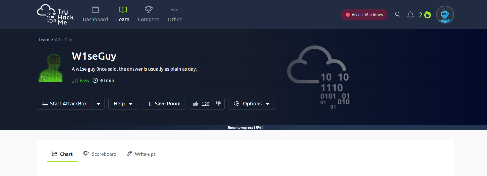
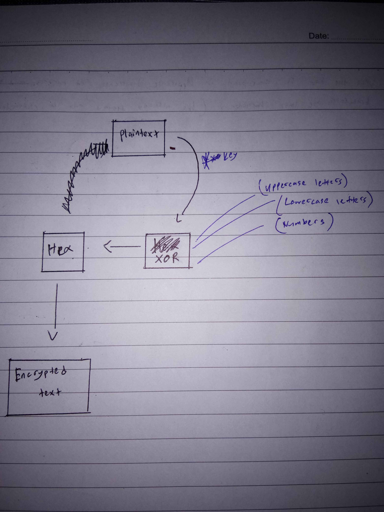
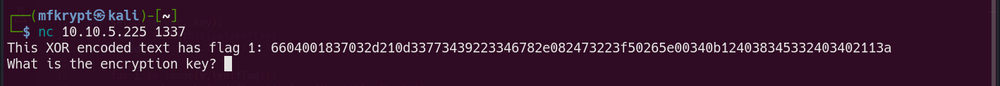
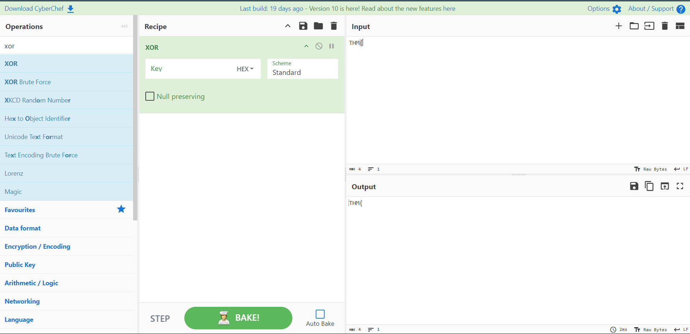
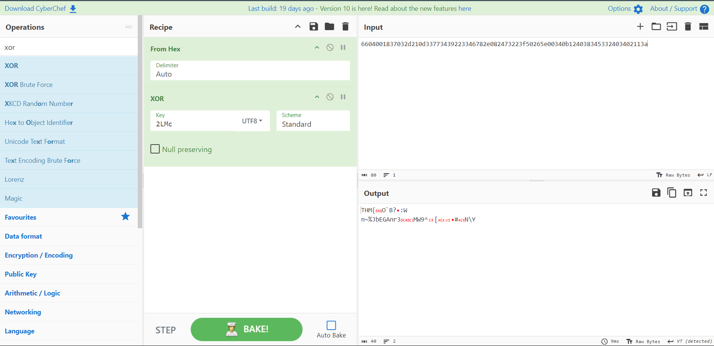
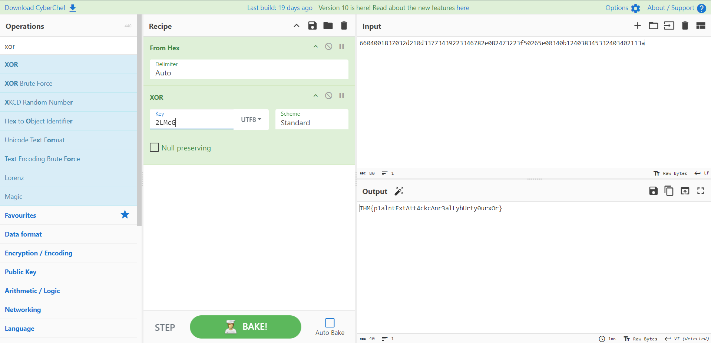
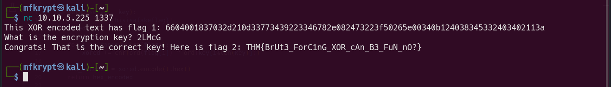

# W1seGuy

Hello again, this time I will be doing this writeup/walkthrough for the recently new challenge that has been released. This was an interesting challenge that I decided to pick up. This room involves some basic understanding of XOR encryption and Brute Forcing.

<figure><figcaption><p>Figure 1</p></figcaption></figure>

Download the Python source code

```python
import random
import socketserver 
import socket, os
import string

flag = open('flag.txt','r').read().strip()

def send_message(server, message):
    enc = message.encode()
    server.send(enc)

def setup(server, key):
    flag = 'THM{thisisafakeflag}' 
    xored = ""

    for i in range(0,len(flag)):
        xored += chr(ord(flag[i]) ^ ord(key[i%len(key)]))

    hex_encoded = xored.encode().hex()
    return hex_encoded

def start(server):
    res = ''.join(random.choices(string.ascii_letters + string.digits, k=5))
    key = str(res)
    hex_encoded = setup(server, key)
    send_message(server, "This XOR encoded text has flag 1: " + hex_encoded + "\n")
    
    send_message(server,"What is the encryption key? ")
    key_answer = server.recv(4096).decode().strip()

    try:
        if key_answer == key:
            send_message(server, "Congrats! That is the correct key! Here is flag 2: " + flag + "\n")
            server.close()
        else:
            send_message(server, 'Close but no cigar' + "\n")
            server.close()
    except:
        send_message(server, "Something went wrong. Please try again. :)\n")
        server.close()

class RequestHandler(socketserver.BaseRequestHandler):
    def handle(self):
        start(self.request)

if __name__ == '__main__':
    socketserver.ThreadingTCPServer.allow_reuse_address = True
    server = socketserver.ThreadingTCPServer(('0.0.0.0', 1337), RequestHandler)
    server.serve_forever()
```

Based on the code given, this part stands out the most

```python
def setup(server, key):
    flag = 'THM{thisisafakeflag}' 
    xored = ""

    for i in range(0,len(flag)):
        xored += chr(ord(flag[i]) ^ ord(key[i%len(key)]))

    hex_encoded = xored.encode().hex()
    return hex_encoded

def start(server):
    res = ''.join(random.choices(string.ascii_letters + string.digits, k=5))
    key = str(res)
    hex_encoded = setup(server, key)
    send_message(server, "This XOR encoded text has flag 1: " + hex_encoded + "\n")
    
    send_message(server,"What is the encryption key? ")
    key_answer = server.recv(4096).decode().strip()
```

Now, by analyzing this section, we can understand that this code sets the user to decode a XOR encrypted text. As soon as a client connects, the server will generate a 5-character key and uses it to encode the flag. The encypted text is then converted to a hexadecimal format and sent to client as a challenge text

Here is a layout of the process I made on the fly lol. The goal of this challenge is to reverse the process to retrieve the key

<figure><figcaption><p>Figure 2</p></figcaption></figure>

Anyways lets look at how the program starts

<figure><figcaption><p>Figure 3</p></figcaption></figure>

We can see that this string of text has 64 characters which is XOR encoded text in hexadecimal

The hint of this challenge is we know the flag will always start with `THM{`

Let's head over to Cyberchef and try to make use of this information

Since we know a part of the plaintext to be encrypted, let's try a reverse approach by converting it into XOR

<figure><figcaption><p>Figure 4</p></figcaption></figure>

Now for the key, we will be using the equivalent amount of bytes of the `THM{` section in the encrypted text, which is 4 bytes. How did i find this?

The calculation for this is a bit messy...:

```
- 1 ASCII character is 8 bits(1 byte)
- 'THM{' = 8 bits x 4
         = 32 bits(4 bytes)


- 1 hex character is 4 bits

    Characters in hex needed to be equivalent = 32 bits / 4 bits
                                              = 8 characters                                              
```

<figure><figcaption><p>Figure 5</p></figcaption></figure>

As we can see, these are the first 4 characters of the encrypted key. Now we need to recreate the process from below by adding on the full encrypted text

<figure><figcaption><p>Figure 6</p></figcaption></figure>

This might seem a bit daunting at first but refer to the initial sketch I did earlier for better readibility.

i also changed the XOR standard to UTF-8 to view non-printable characters.

At this point we only have 4 characters, the full encrypted text is a 5-character key. Based on this line of code:

```python
res = ''.join(random.choices(string.ascii_letters + string.digits, k=5))
    key = str(res)
```

We know that the options are only Upper Capital letters, Lower capital letters and Numbers. So we can try and brute force the last character one by one until we get a suitable match

## Question 1

***

### What is the first flag?

After a few attempts, I finally got a result

<figure><figcaption><p>Figure 7</p></figcaption></figure>

**Answer:**`THM{p1alntExtAtt4ckcAnr3alLyhUrty0urxOr}`

## Question 2

***

### What is the second and final flag?

Just input the key we bruteforced earlier...

<figure><figcaption><p>Figure 8</p></figcaption></figure>

**Answer:**`THM{BrUt3_ForC1nG_XOR_cAn_B3_FuN_nO?}`
