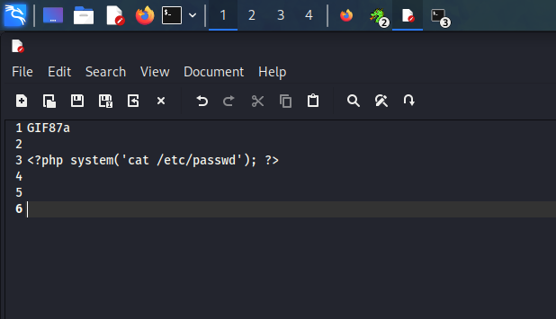
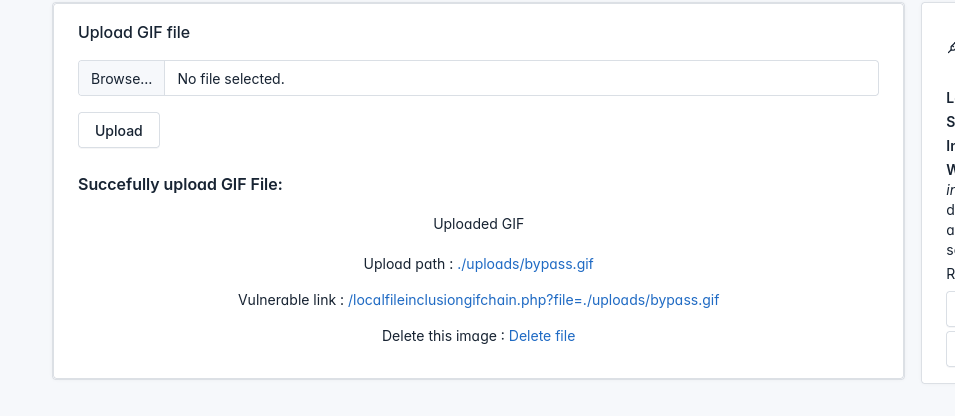
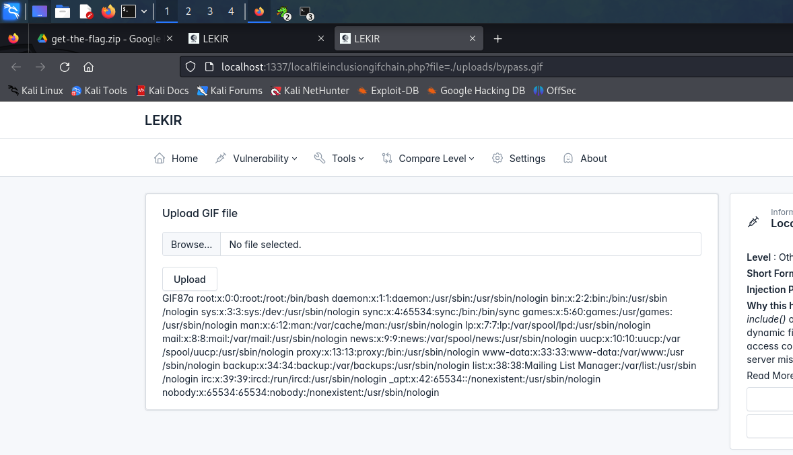

# LFI Gif Upload Chain

LFI via GIF upload chain is a common exploitation technique that manipulates a file upload functionality to gain access to sensitive files on a server. This is achieved by inserting malicious payload all the while exploiting LFI vulnerabilities on a vulnerable web.

<figure><figcaption></figcaption></figure>

Try uploading any file. I will upload a png image

<figure><figcaption></figcaption></figure>

As clearly stated it only validates a GIF file. Let's check out the source

<pre class="language-php"><code class="lang-php"><strong>
</strong><strong>&#x3C;?php
</strong>if ($_SERVER["REQUEST_METHOD"] == "POST") {

  if (isset($_FILES["image"])) {
    
    $filename = $_FILES["image"]["name"];
    $fileext = substr($filename, strrpos($filename, '.') + 1);
    $filetmp = $_FILES["image"]["tmp_name"];

    if((strtolower($fileext) == "gif") &#x26;&#x26; getimagesize($filetmp)){
      // Move uploaded files to desired location
      move_uploaded_file($filetmp, "uploads/$filename");

}

if(isset($_GET['file'])){

  if(strlen($_GET['file']) > 150){

    echo "&#x3C;pre>Parameter has a maximum character limit of 150&#x3C;/pre>";
    exit();

  }

  include($_GET['file']);

}

?>

</code></pre>

Observe this specific snippet

```php
if((strtolower($fileext) == "gif") && getimagesize($filetmp)){
      // Move uploaded files to desired location
      move_uploaded_file($filetmp, "uploads/$filename");
```

The code attempts to validate the file **Extension** and verifies that the uploaded file is a valid image using `getimagesize()`&#x20;

`getimagesize()` returns information such as the width and the height of the image


&#x20;Lets try to bypass this step by step

### 1. Create a file with a .gif extension

<figure><figcaption></figcaption></figure>

### 2. Magic Numbers

The next thing we do is add a thing called **Magic Numbers** at the beginning of the file. These are also called **File Signatures.** Refer to this [website](https://en.wikipedia.org/wiki/List_of_file_signatures)

For gifs we use any of these two to append at the beginning of our file

<figure><figcaption></figcaption></figure>

Just like this, save it and upload&#x20;

<figure><figcaption></figcaption></figure>

It didn't work...becauseee of the `getimagesize()` function which didn't recognize the file because it only contains the header

<figure><figcaption></figcaption></figure>

Try inputting anything in the file and try again

<figure><figcaption></figcaption></figure>

<figure><figcaption></figcaption></figure>

It worked. It also means we bypassed both conditions. What we can do now is enter malicious payload in our file. For example,

<figure><figcaption></figcaption></figure>

Navigate to the Vulnerable link&#x20;

<figure><figcaption></figcaption></figure>

Our payload earlier should be successful like this

<figure><figcaption></figcaption></figure>

