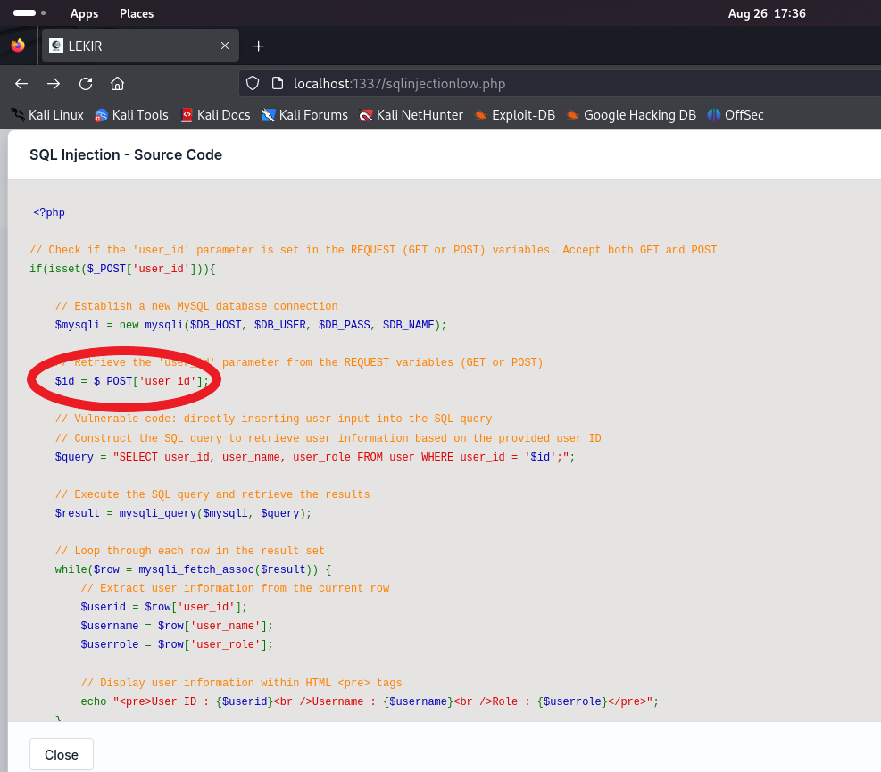

# SQL Injection with sqlmap

Navigate to the SQL Injection Low section

<figure><figcaption></figcaption></figure>

Before we proceed, note that the goal of this session is to acquire a secret text in a column inside the database

## Identifying Parameters

***

First things first, press `Ctrl + Shift + I` on your keyboard to enable the Develepor tools and refresh the page, Head to the Network Tab

<figure><figcaption></figcaption></figure>

<figure><figcaption></figcaption></figure>

In the mini-tab to the right switch to the Request section


<figure><figcaption></figcaption></figure>

You might be wondering...what did I do? Well, to put in simple terms, we just inspected network requests to identify available parameters. This is essential to test the parameters in the sqlmap command. As you can see, we have the `user_id` parameter

Now, let's get to utilizing the tool itself

## Crafting the payload

***

<figure><figcaption></figcaption></figure>

There are a bunch of options we could use, but the optimal one would be&#x20;

```shell-session
$ sqlmap -u <URL> -p <parameter to test> --dbs
```

<mark style="color:red;">--dbs</mark> # List names of the available databases

<figure><figcaption></figcaption></figure>

Huh, it didn't work. Lets check why

After checking the source code, it seems that the `user_id` parameter was requested using a POST request. Which meansssss, we need to specify that in the body of the request using the `--data` option.

<figure><figcaption></figcaption></figure>

The new command will be:

```shell-session
$ sqlmap -u http://localhost:1337/sqlinjectionlow.php -p user_id --data "user_id=1" --dbs
```

Let's test that out

<figure><figcaption></figcaption></figure>

Damn, it didn't work. Anyways after a bit of troubleshooting, it was discovered that initially, when you want to access Lekir Framework you need to be logged in right? Guess what is given after being authenticated?&#x20;

COOKIES !

Check out the session cookie inside your Developer Tools under the name PHPSESSID. This cookie gives sqlmap the access to perform correctly and test the vulnerabilities.

<figure><figcaption></figcaption></figure>

So the new command will be:

```shell-session
$ sqlmap -u http://localhost:1337/sqlinjectionlow.php -p user_id --data "user_id=1" --cookie "PHPSESSID=6a9bcf2d49fa427c1dada370feefffb1" --dbs
```

Let's run it

## Enumerating information

***

<figure><figcaption></figcaption></figure>

Let's go, we successfully listed the available databases. Now we have a foothold. Keep that momentum and enumerate other stuff like tables by adding `--tables` to the command

Now if you run the that command, we got a whole lot of stuff here&#x20;

But we are most interested in this table because there is a 'secret'

<figure><figcaption></figcaption></figure>

Now that we know the table which contains the 'secret' we can dump it using the `--dump` option . Add it to the full command earlier.

<pre class="language-shell-session"><code class="lang-shell-session"><strong>$ sqlmap -u http://localhost:1337/sqlinjectionlow.php -p user_id --data "user_id=1" --cookie "PHPSESSID=6a9bcf2d49fa427c1dada370feefffb1" --dbs -T secret --dump
</strong></code></pre>

<mark style="color:red;">-T</mark> # Specify the name of the table

Run the final command

<figure><figcaption></figcaption></figure>

And, we got a string that looks like base64 encoded data

Just throw it into a decoder

<figure><figcaption></figcaption></figure>

Nice one bang Daus hehe,&#x20;

Overall this challenge introduces a basic introduction on how to use sqlmap&#x20;
